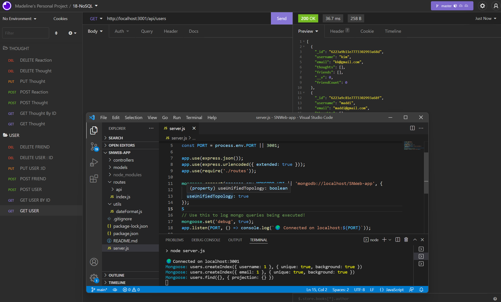

# SNWeb-app

# Description
For this week challenge, We had to build an API for a social network web application where users can share their thoughts, react to friends’ thoughts, and create a friend list. For this challenge, we will be using the Express.js and Mongoose packages. Mongoose is a popular choice for many social networks due to its speed with large amounts of data and flexibility with unstructured data. Because this application won’t be deployed, a walkthorought video was created to test the functionality of the routes on Insomnia.



# Table of contents
[Installation](#Installation)<br>
[Usage](#Usage)<br>
[User Story](#User-Story)<br>
[Acceptance Criteria](#Acceptance-Criteria)<br>
[Credits](#Credits)<br>
[Walkthrough Video](#Walkthrough-Video)<br>

https://user-images.githubusercontent.com/92236398/156939398-325ecbf2-4ce5-46f9-b3d2-43c12b37477d.mp4


# Installation
```
npm init -y
```
### Install npm Packages
we've installed the express and mongoose packages
```
npm install express
npm install mongoose
```
# Usage
Execute the script as follows:
```
node server
```
```h
const express = require('express');
const app = express()

app.get('/', function (req, res) {
  res.send('Hello World')
})

app.listen(3000)
```
```h
const mongoose = require('mongoose');
const Comment = new Schema({
  name: { type: String, default: 'hahaha' },
  age: { type: Number, min: 18, index: true },
  bio: { type: String, match: /[a-z]/ },
  date: { type: Date, default: Date.now },
  buff: Buffer
});

// Setters allow you to transform the data before it gets to the raw mongodb document or query.
Comment.path('name').set(function (v) {
  return capitalize(v);
});

// Middleware are functions which are passed control during execution of asynchronous functions.
Comment.pre('save', function (next) {
  notify(this.get('email'));
  next();
});
```

# User Story
```
AS A social media startup
I WANT an API for my social network that uses a NoSQL database
SO THAT my website can handle large amounts of unstructured data
```
# Acceptance Criteria
```
GIVEN a social network API
WHEN I enter the command to invoke the application
THEN my server is started and the Mongoose models are synced to the MongoDB database
WHEN I open API GET routes in Insomnia for users and thoughts
THEN the data for each of these routes is displayed in a formatted JSON
WHEN I test API POST, PUT, and DELETE routes in Insomnia
THEN I am able to successfully create, update, and delete users and thoughts in my database
WHEN I test API POST and DELETE routes in Insomnia
THEN I am able to successfully create and delete reactions to thoughts and add and remove friends to a user’s friend list
```
# Credits

GitHub: https://github.com/maddi124<br>

# Walkthrough Video
```
The walkthrough video must show all of the technical acceptance criteria being met.

The walkthrough video must demonstrate how to start the application’s server.

The walkthrough video must demonstrate GET routes for all users and all thoughts being tested in Insomnia.

The walkthrough video must demonstrate GET routes for a single user and a single thought being tested in Insomnia.

The walkthrough video must demonstrate POST, PUT, and DELETE routes for users and thoughts being tested in Insomnia.

Walkthrough video must demonstrate POST and DELETE routes for a user’s friend list being tested in Insomnia.

Walkthrough video must demonstrate POST and DELETE routes for reactions to thoughts being tested in Insomnia.
```
### THOUGHT Walkthrough:
https://drive.google.com/file/d/1vcd7OIRtPnYO4OUJ94E8eqA9AmojZWIl/view
### USER Walkthrough:
https://drive.google.com/file/d/1F3Eza9Rst_lKXcP6VsO8qX1sFIDpe9uB/view
